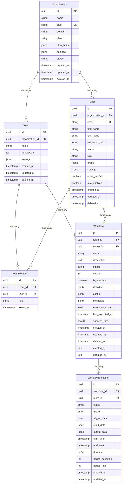

# Database Architecture Documentation

## Overview

n8n-pro uses a **production-grade PostgreSQL database architecture** with **GORM** as the ORM, following patterns used by GitHub, GitLab, Stripe, and other large-scale applications.

## Technology Stack

- **Database**: PostgreSQL 14+
- **ORM**: GORM v1.31+ with PostgreSQL driver
- **Connection Pooling**: Built-in GORM/pgx pooling
- **Migrations**: Custom migration system with version tracking
- **Patterns**: Repository pattern with service layer

## Database Schema

### Core Entities



## Model Definitions

### Base Models

All models inherit from `BaseModel` which provides:
- UUID primary key with auto-generation
- Created/Updated timestamps
- Soft delete support with proper indexing

```go
type BaseModel struct {
    ID        string         `gorm:"primaryKey;type:uuid;default:gen_random_uuid()"`
    CreatedAt time.Time      `gorm:"not null"`
    UpdatedAt time.Time      `gorm:"not null"`
    DeletedAt gorm.DeletedAt `gorm:"index"`
}
```

### Custom Types

#### JSONB for PostgreSQL
```go
type JSONB map[string]interface{}
// Implements driver.Valuer and sql.Scanner for PostgreSQL JSONB
```

#### StringSlice for Arrays
```go
type StringSlice []string  
// Implements driver.Valuer and sql.Scanner for PostgreSQL arrays
```

## Indexes and Performance

### Automatic GORM Indexes
- Primary keys (UUID)
- Foreign keys
- Unique constraints
- Soft delete indexes

### Custom Performance Indexes
```sql
-- User lookups
CREATE INDEX CONCURRENTLY idx_users_org_email_active ON users(organization_id, email) WHERE deleted_at IS NULL;

-- Workflow queries
CREATE INDEX CONCURRENTLY idx_workflows_team_status ON workflows(team_id, status) WHERE deleted_at IS NULL;

-- Execution queries  
CREATE INDEX CONCURRENTLY idx_executions_workflow_status ON workflow_executions(workflow_id, status);
CREATE INDEX CONCURRENTLY idx_executions_start_time ON workflow_executions(start_time DESC);

-- Full-text search
CREATE INDEX CONCURRENTLY idx_workflows_search ON workflows USING gin(to_tsvector('english', name || ' ' || description));
CREATE INDEX CONCURRENTLY idx_users_search ON users USING gin(to_tsvector('english', first_name || ' ' || last_name || ' ' || email));

-- JSONB queries
CREATE INDEX CONCURRENTLY idx_workflows_definition_gin ON workflows USING gin(definition);
CREATE INDEX CONCURRENTLY idx_users_settings_gin ON users USING gin(settings);
```

## Service Layer Pattern

### UserService Example
```go
type UserService struct {
    db *database.Database
}

// Business logic methods
func (s *UserService) CreateUser(ctx context.Context, req CreateUserRequest) (*models.User, error)
func (s *UserService) GetUserByID(ctx context.Context, userID string) (*models.User, error)
func (s *UserService) VerifyPassword(ctx context.Context, email, password string) (*models.User, error)
```

### Benefits
- ✅ Separation of concerns
- ✅ Testable business logic
- ✅ Context-aware operations
- ✅ Consistent error handling
- ✅ Transaction management

## Query Patterns

### Using Scopes
```go
// Find active workflows for a team
workflows := []models.Workflow{}
db.Scopes(
    models.Active,
    models.ByTeam(teamID),
    models.ByStatus("active"),
    models.Recent,
    models.Paginate(page, pageSize),
).Find(&workflows)
```

### Complex Queries with Preloading
```go
var user models.User
db.WithContext(ctx).
   Preload("Organization").
   Preload("TeamMembers.Team").
   First(&user, "id = ?", userID)
```

### JSONB Queries
```go
// Query JSONB fields
var users []models.User
db.Where("profile->>'job_title' = ?", "Engineer").Find(&users)

// Full-text search
db.Where("to_tsvector('english', name || ' ' || description) @@ plainto_tsquery('english', ?)", searchTerm)
```

## Migration System

### Migration Structure
```go
type Migration struct {
    Version string
    Name    string  
    Up      func() error
}
```

### Running Migrations
```go
migrationManager := database.NewMigrationManager(db)
err := migrationManager.RunMigrations()
```

### Migration Tracking
- Migrations are tracked in `migration_records` table
- Each migration runs in a transaction
- Failed migrations are rolled back automatically
- Rollback support for individual migrations

## Security Features

### Password Security
- Bcrypt hashing with configurable cost
- Account lockout after failed attempts
- Password change tracking

### Audit Trail
```go
type AuditLog struct {
    OrganizationID string
    ActorType      string  // user, system, api, service
    ActorID        string
    EventType      string
    ResourceType   string
    ResourceID     string
    Details        JSONB
    IPAddress      string
    UserAgent      string
    Success        bool
    Severity       string  // low, medium, high, critical
}
```

### Session Management
- Secure session tracking with refresh tokens
- IP address and user agent logging
- Session expiration and cleanup

## Performance Considerations

### Connection Pooling
```go
// Optimized settings
MaxOpenConnections:  25
MaxIdleConnections:  5
ConnectionLifetime:  5 * time.Minute
```

### Query Optimization
- Prepared statements enabled
- Batch operations for bulk inserts
- Skip default transactions for read operations
- Proper indexing for common query patterns

### JSONB Usage
- Store flexible configuration and metadata
- Index frequently queried JSON fields
- Use appropriate operators (->>, @>, etc.)

## Monitoring and Observability

### Query Logging
- Slow query threshold monitoring
- Colorful development logs
- Silent production logs

### Health Checks
```go
healthStatus := db.Health(ctx)
// Returns connection stats, open/idle connections, etc.
```

### Metrics Integration
- OpenTelemetry tracing support
- Database connection metrics
- Query performance monitoring

## Best Practices

### Model Design
1. Use UUIDs for all primary keys
2. Implement proper soft delete
3. Add appropriate indexes
4. Use JSONB for flexible data
5. Follow naming conventions

### Service Layer
1. Keep business logic in services
2. Use context for cancellation
3. Handle errors appropriately
4. Implement proper pagination
5. Use transactions when needed

### Security
1. Hash all passwords
2. Implement audit logging
3. Use parameterized queries
4. Validate all inputs
5. Implement rate limiting

### Performance
1. Use connection pooling
2. Create proper indexes
3. Monitor slow queries
4. Use prepared statements
5. Batch bulk operations

## Environment Configuration

### Development
```env
DB_HOST=localhost
DB_PORT=5432
DB_NAME=n8n_pro_dev
DB_USER=developer
DB_PASSWORD=dev_password
DB_SSL_MODE=disable
DB_ENABLE_QUERY_LOGGING=true
DB_SLOW_QUERY_THRESHOLD=500ms
```

### Production
```env
DB_HOST=db.production.com
DB_PORT=5432
DB_NAME=n8n_pro
DB_USER=n8n_app
DB_PASSWORD=secure_random_password
DB_SSL_MODE=require
DB_ENABLE_QUERY_LOGGING=false
DB_SLOW_QUERY_THRESHOLD=2s
DB_MAX_OPEN_CONNECTIONS=50
DB_MAX_IDLE_CONNECTIONS=10
```

## Backup and Recovery

### Automated Backups
- Daily full backups
- Point-in-time recovery
- Cross-region replication for critical data

### Migration Rollback
```go
// Rollback specific migration
migrationManager.RollbackMigration("005")

// Get applied migrations
migrations, err := migrationManager.GetAppliedMigrations()
```

## Testing

### Unit Tests
- Mock database connections
- Test business logic in isolation
- Use testify for assertions

### Integration Tests  
- Test database operations
- Use test database
- Clean up after tests

### Performance Tests
- Benchmark critical queries
- Load test connection pools
- Monitor resource usage

This architecture provides a solid foundation for a production-scale application with proper separation of concerns, security, and performance optimization.