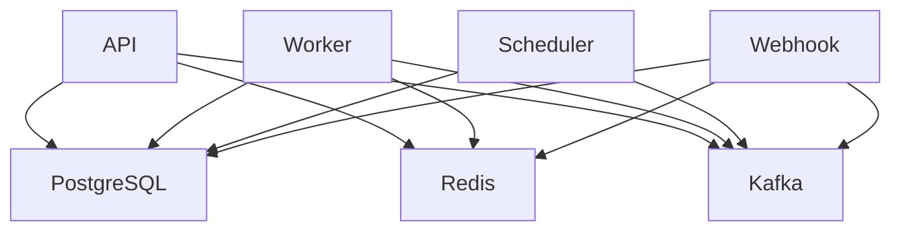

# Docker Deployment Guide

This guide covers deploying n8n Pro using Docker and Docker Compose for development, testing, and production environments.

## Prerequisites

- **Docker**: Version 20.10 or later
- **Docker Compose**: Version 2.0 or later
- **Minimum System Requirements**:
  - 2 CPU cores
  - 4GB RAM
  - 20GB disk space

## Quick Start

### 1. Clone the Repository

```bash
git clone https://github.com/your-org/n8n-pro.git
cd n8n-pro
```

### 2. Start All Services

```bash
# Start all services in the background
docker-compose up -d

# Check service status
docker-compose ps

# View logs
docker-compose logs -f
```

### 3. Access the Application

- **API**: http://localhost:8080
- **Webhook Service**: http://localhost:8081  
- **Worker Health**: http://localhost:8082
- **Metrics**: http://localhost:9090

### 4. Create Your First User

```bash
curl -X POST http://localhost:8080/api/v1/auth/register \
  -H "Content-Type: application/json" \
  -d '{
    "email": "admin@example.com",
    "password": "secure_password_123",
    "first_name": "Admin",
    "last_name": "User"
  }'
```

## Docker Compose Configuration

### Default Configuration

The default `docker-compose.yml` includes all necessary services:

```yaml
services:
  # Core Services
  api:        # REST API (port 8080)
  worker:     # Workflow execution (port 8082)
  scheduler:  # Job scheduling (internal)
  webhook:    # Webhook processing (port 8081)
  
  # Infrastructure
  postgres:   # Database (port 5432)
  redis:      # Cache/Sessions (port 6379)
  kafka:      # Message Queue (port 9092)
```

### Service Dependencies



### Volume Mounts

```yaml
volumes:
  postgres_data:    # PostgreSQL data persistence
  redis_data:       # Redis data persistence  
  kafka_data:       # Kafka logs and data
  ./storage:/app/storage  # File storage (host mount)
```

## Production Deployment

### 1. Environment Configuration

Create a production environment file:

```bash
# Copy the production template
cp deployments/docker/.env.production .env

# Edit with your production values
vim .env
```

Production `.env` example:

```bash
# Application
ENVIRONMENT=production
DEBUG=false
LOG_LEVEL=info

# API Configuration
API_HOST=0.0.0.0
API_PORT=8080
API_ENABLE_CORS=false
API_CORS_ALLOWED_ORIGINS=https://your-domain.com

# Database (use external PostgreSQL in production)
DB_HOST=your-postgres-host.com
DB_PORT=5432
DB_NAME=n8n_pro
DB_USER=n8n_user
DB_PASSWORD=secure_production_password
DB_SSL_MODE=require

# Redis (use external Redis in production)
REDIS_HOST=your-redis-host.com
REDIS_PORT=6379
REDIS_PASSWORD=secure_redis_password

# Kafka (use external Kafka in production)
KAFKA_BROKERS=kafka1.example.com:9092,kafka2.example.com:9092

# Security
JWT_SECRET=your-super-secure-jwt-secret-key-change-this
ENCRYPTION_KEY=your-32-character-encryption-key-here

# TLS/SSL
API_ENABLE_TLS=true
API_TLS_CERT_FILE=/certs/api.crt
API_TLS_KEY_FILE=/certs/api.key

# Features
SCHEDULER_ENABLE_DISTRIBUTED_MODE=true
WORKER_CONCURRENCY=20
METRICS_ENABLED=true
```

### 2. Production Docker Compose

Create a production compose file:

```yaml
# docker-compose.prod.yml
services:
  api:
    image: n8n-pro/api:${VERSION:-latest}
    ports:
      - "80:8080"
      - "443:8443"
    environment:
      <<: *common-environment
      METRICS_SERVICE_NAME: api
    volumes:
      - ./certs:/certs:ro
      - ./storage:/app/storage
    deploy:
      replicas: 3
      resources:
        limits:
          cpus: '1.0'
          memory: 1G
        reservations:
          cpus: '0.5'
          memory: 512M
    healthcheck:
      test: ["CMD", "curl", "-f", "http://localhost:8080/health"]
      interval: 30s
      timeout: 10s
      retries: 3
      start_period: 40s

  worker:
    image: n8n-pro/worker:${VERSION:-latest}
    ports:
      - "8082:8082"
    environment:
      <<: *common-environment
      METRICS_SERVICE_NAME: worker
      WORKER_CONCURRENCY: 20
    volumes:
      - ./storage:/app/storage
    deploy:
      replicas: 5
      resources:
        limits:
          cpus: '2.0'
          memory: 2G
        reservations:
          cpus: '1.0'
          memory: 1G

  scheduler:
    image: n8n-pro/scheduler:${VERSION:-latest}
    environment:
      <<: *common-environment
      METRICS_SERVICE_NAME: scheduler
      SCHEDULER_ENABLE_DISTRIBUTED_MODE: true
    deploy:
      replicas: 2
      resources:
        limits:
          cpus: '0.5'
          memory: 512M

  webhook:
    image: n8n-pro/webhook:${VERSION:-latest}
    ports:
      - "8081:8081"
    environment:
      <<: *common-environment
      METRICS_SERVICE_NAME: webhook
    volumes:
      - ./storage:/app/storage
    deploy:
      replicas: 3
      resources:
        limits:
          cpus: '1.0'
          memory: 1G

  # External services configuration
  nginx:
    image: nginx:alpine
    ports:
      - "80:80"
      - "443:443"
    volumes:
      - ./nginx.conf:/etc/nginx/nginx.conf:ro
      - ./certs:/certs:ro
    depends_on:
      - api
      - webhook

x-common-environment: &common-environment
  ENVIRONMENT: production
  LOG_LEVEL: info
  DB_HOST: ${DB_HOST}
  DB_PASSWORD: ${DB_PASSWORD}
  REDIS_HOST: ${REDIS_HOST}
  REDIS_PASSWORD: ${REDIS_PASSWORD}
  KAFKA_BROKERS: ${KAFKA_BROKERS}
  JWT_SECRET: ${JWT_SECRET}
  ENCRYPTION_KEY: ${ENCRYPTION_KEY}
```

### 3. Deploy to Production

```bash
# Build production images
make docker-build VERSION=1.0.0

# Deploy with production configuration
docker-compose -f docker-compose.prod.yml up -d

# Monitor deployment
docker-compose -f docker-compose.prod.yml ps
docker-compose -f docker-compose.prod.yml logs -f
```

## Load Balancer Configuration

### Nginx Configuration

```nginx
# nginx.conf
upstream api_backend {
    least_conn;
    server api_1:8080 max_fails=3 fail_timeout=30s;
    server api_2:8080 max_fails=3 fail_timeout=30s;
    server api_3:8080 max_fails=3 fail_timeout=30s;
}

upstream webhook_backend {
    least_conn;
    server webhook_1:8081 max_fails=3 fail_timeout=30s;
    server webhook_2:8081 max_fails=3 fail_timeout=30s;
    server webhook_3:8081 max_fails=3 fail_timeout=30s;
}

server {
    listen 80;
    listen 443 ssl http2;
    
    server_name api.n8n-pro.com;
    
    ssl_certificate /certs/api.crt;
    ssl_certificate_key /certs/api.key;
    
    # Redirect HTTP to HTTPS
    if ($scheme != "https") {
        return 301 https://$host$request_uri;
    }
    
    # API routes
    location /api/ {
        proxy_pass http://api_backend;
        proxy_set_header Host $host;
        proxy_set_header X-Real-IP $remote_addr;
        proxy_set_header X-Forwarded-For $proxy_add_x_forwarded_for;
        proxy_set_header X-Forwarded-Proto $scheme;
        
        # Timeouts
        proxy_connect_timeout 5s;
        proxy_send_timeout 60s;
        proxy_read_timeout 60s;
    }
    
    # Health check
    location /health {
        proxy_pass http://api_backend/health;
    }
    
    # Metrics (restrict access)
    location /metrics {
        allow 10.0.0.0/8;
        deny all;
        proxy_pass http://api_backend/metrics;
    }
}

server {
    listen 80;
    listen 443 ssl http2;
    
    server_name webhooks.n8n-pro.com;
    
    ssl_certificate /certs/webhook.crt;
    ssl_certificate_key /certs/webhook.key;
    
    # Webhook routes
    location / {
        proxy_pass http://webhook_backend;
        proxy_set_header Host $host;
        proxy_set_header X-Real-IP $remote_addr;
        proxy_set_header X-Forwarded-For $proxy_add_x_forwarded_for;
        proxy_set_header X-Forwarded-Proto $scheme;
        
        # Increase body size for webhooks
        client_max_body_size 50M;
        
        # Disable buffering for real-time processing
        proxy_buffering off;
        proxy_request_buffering off;
    }
}
```

## Monitoring and Logging

### Docker Compose with Monitoring

```yaml
# docker-compose.monitoring.yml
services:
  prometheus:
    image: prom/prometheus:latest
    ports:
      - "9090:9090"
    volumes:
      - ./prometheus.yml:/etc/prometheus/prometheus.yml
      - prometheus_data:/prometheus
    command:
      - '--config.file=/etc/prometheus/prometheus.yml'
      - '--storage.tsdb.path=/prometheus'
      - '--web.console.libraries=/etc/prometheus/console_libraries'
      - '--web.console.templates=/etc/prometheus/consoles'

  grafana:
    image: grafana/grafana:latest
    ports:
      - "3000:3000"
    environment:
      - GF_SECURITY_ADMIN_PASSWORD=admin
    volumes:
      - grafana_data:/var/lib/grafana
      - ./grafana/dashboards:/etc/grafana/provisioning/dashboards
      - ./grafana/datasources:/etc/grafana/provisioning/datasources

  loki:
    image: grafana/loki:latest
    ports:
      - "3100:3100"
    command: -config.file=/etc/loki/local-config.yaml
    volumes:
      - loki_data:/loki

  promtail:
    image: grafana/promtail:latest
    volumes:
      - /var/log:/var/log:ro
      - /var/lib/docker/containers:/var/lib/docker/containers:ro
      - ./promtail-config.yml:/etc/promtail/config.yml
    command: -config.file=/etc/promtail/config.yml

volumes:
  prometheus_data:
  grafana_data:
  loki_data:
```

### Prometheus Configuration

```yaml
# prometheus.yml
global:
  scrape_interval: 15s

scrape_configs:
  - job_name: 'n8n-pro-api'
    static_configs:
      - targets: ['api:9090']
    metrics_path: '/metrics'
    scrape_interval: 30s

  - job_name: 'n8n-pro-worker'  
    static_configs:
      - targets: ['worker:8082']
    metrics_path: '/metrics'
    scrape_interval: 30s

  - job_name: 'n8n-pro-webhook'
    static_configs:
      - targets: ['webhook:8081']
    metrics_path: '/metrics'
    scrape_interval: 30s
```

## Security Hardening

### 1. Network Security

```yaml
# Create custom networks
networks:
  frontend:
    driver: bridge
  backend:
    driver: bridge
    internal: true

services:
  nginx:
    networks:
      - frontend
      - backend
      
  api:
    networks:
      - backend
    # Remove direct port exposure
    # ports:
    #   - "8080:8080"
      
  postgres:
    networks:
      - backend
    # Remove port exposure
    # ports:
    #   - "5432:5432"
```

### 2. Secrets Management

```yaml
# Use Docker secrets for sensitive data
secrets:
  db_password:
    file: ./secrets/db_password.txt
  jwt_secret:
    file: ./secrets/jwt_secret.txt
  encryption_key:
    file: ./secrets/encryption_key.txt

services:
  api:
    secrets:
      - db_password
      - jwt_secret  
      - encryption_key
    environment:
      DB_PASSWORD_FILE: /run/secrets/db_password
      JWT_SECRET_FILE: /run/secrets/jwt_secret
      ENCRYPTION_KEY_FILE: /run/secrets/encryption_key
```

### 3. User Permissions

```dockerfile
# Run as non-root user
FROM alpine:3.19

RUN addgroup -g 1001 -S n8n && \
    adduser -S -D -H -u 1001 -h /app -s /sbin/nologin -G n8n -g n8n n8n

USER n8n
```

## Backup and Recovery

### Database Backup

```bash
#!/bin/bash
# backup-database.sh

BACKUP_DIR="/backups"
TIMESTAMP=$(date +%Y%m%d_%H%M%S)
BACKUP_FILE="$BACKUP_DIR/n8n_backup_$TIMESTAMP.sql"

# Create backup directory
mkdir -p $BACKUP_DIR

# Run pg_dump inside postgres container
docker-compose exec -T postgres pg_dump -U user n8n_clone > $BACKUP_FILE

# Compress backup
gzip $BACKUP_FILE

# Clean old backups (keep last 7 days)
find $BACKUP_DIR -name "*.sql.gz" -mtime +7 -delete

echo "Backup completed: $BACKUP_FILE.gz"
```

### Storage Backup

```bash
#!/bin/bash
# backup-storage.sh

BACKUP_DIR="/backups"
TIMESTAMP=$(date +%Y%m%d_%H%M%S)
STORAGE_BACKUP="$BACKUP_DIR/storage_backup_$TIMESTAMP.tar.gz"

# Backup storage directory
tar -czf $STORAGE_BACKUP ./storage/

# Clean old storage backups
find $BACKUP_DIR -name "storage_backup_*.tar.gz" -mtime +7 -delete

echo "Storage backup completed: $STORAGE_BACKUP"
```

### Automated Backup

```yaml
# docker-compose.backup.yml
services:
  backup:
    image: alpine:3.19
    volumes:
      - ./backups:/backups
      - ./storage:/data/storage:ro
      - ./scripts:/scripts:ro
    environment:
      - POSTGRES_HOST=postgres
      - POSTGRES_DB=n8n_clone
      - POSTGRES_USER=user
      - POSTGRES_PASSWORD=password
    command: /scripts/backup.sh
    depends_on:
      - postgres
    profiles:
      - backup

  # Scheduled backup with cron
  backup-cron:
    image: alpine:3.19
    volumes:
      - ./backups:/backups
      - ./storage:/data/storage:ro
      - ./scripts:/scripts:ro
    environment:
      - POSTGRES_HOST=postgres
      - POSTGRES_DB=n8n_clone
      - POSTGRES_USER=user
      - POSTGRES_PASSWORD=password
    command: crond -f -d 8
    # Add crontab for daily backups at 2 AM
    entrypoint: |
      sh -c '
        echo "0 2 * * * /scripts/backup.sh" | crontab -
        crond -f -d 8
      '
```

## Troubleshooting

### Common Issues

#### 1. Container Won't Start

```bash
# Check container status
docker-compose ps

# Check container logs
docker-compose logs [service_name]

# Check resource usage
docker stats

# Inspect container configuration
docker inspect n8n-pro-api
```

#### 2. Database Connection Issues

```bash
# Test database connectivity
docker-compose exec api nc -z postgres 5432

# Check database logs
docker-compose logs postgres

# Connect to database directly
docker-compose exec postgres psql -U user -d n8n_clone
```

#### 3. Out of Memory Issues

```bash
# Check memory usage
docker stats --no-stream

# Increase memory limits in docker-compose.yml
services:
  api:
    deploy:
      resources:
        limits:
          memory: 2G
```

#### 4. Storage Issues

```bash
# Check disk usage
df -h

# Check Docker disk usage  
docker system df

# Clean unused resources
docker system prune
```

### Performance Tuning

#### 1. Resource Allocation

```yaml
services:
  api:
    deploy:
      resources:
        limits:
          cpus: '2.0'
          memory: 2G
        reservations:
          cpus: '1.0'  
          memory: 1G

  postgres:
    deploy:
      resources:
        limits:
          memory: 2G
        reservations:
          memory: 1G
    environment:
      - POSTGRES_SHARED_BUFFERS=512MB
      - POSTGRES_EFFECTIVE_CACHE_SIZE=1GB
```

#### 2. Connection Tuning

```bash
# Increase connection limits
DB_MAX_OPEN_CONNECTIONS=50
DB_MAX_IDLE_CONNECTIONS=10

# Redis connection tuning  
REDIS_POOL_SIZE=20
REDIS_MIN_IDLE_CONNECTIONS=5

# Worker concurrency
WORKER_CONCURRENCY=20
WORKER_JOB_TIMEOUT=15m
```

## Maintenance

### Updates and Upgrades

```bash
# Pull latest images
docker-compose pull

# Update with zero downtime (rolling update)
docker-compose up -d --no-deps --scale api=2 api
docker-compose up -d --no-deps --scale api=1 api

# Check service health
docker-compose exec api curl -f http://localhost:8080/health
```

### Log Management

```bash
# View logs with timestamps
docker-compose logs -f -t

# Limit log size
docker-compose logs --tail=100

# Configure log rotation in docker-compose.yml
services:
  api:
    logging:
      driver: "json-file" 
      options:
        max-size: "10m"
        max-file: "3"
```

This comprehensive Docker deployment guide should help you deploy n8n Pro successfully in various environments, from development to production scale.